# 26E2 - INFNET - Trabalho PD modelos preditivos utilizando KNIME

## Author: Alan C. Echer

## 1. Etapa 1 – Coleta e Preparação dos Dados

### 1.1. Coleta dos dados

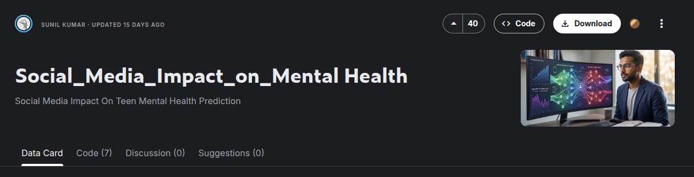

Para este trabalho utilizarei a base de dados do kaggle: https://www.kaggle.com/datasets/sunil123kumar/social-media-impact-on-mental-health

A base foi escolhida por abordar um problema atual e de grande relevância social: a relação entre o uso de redes sociais e indicadores de saúde mental em adolescentes. Além disso, apresenta variáveis numéricas e categóricas, sendo adequada para aplicação de diferentes algoritmos de classificação estudados na disciplina.

A base possui 1200 registros válidos e nenhuma variável apresenta valores ausentes, ela contém dados da utilização de redes sociais por adolescentes, seus hábitos, performance escolar e indicadores mentais.

A base reúne informações sobre:

* idade;
* gênero;
* tempo diário de uso das redes sociais;
* plataforma utilizada;
* horas de sono;
* tempo de tela antes de dormir;
* desempenho escolar;
* atividade física;
* interação social;
* níveis de estresse;
* ansiedade;
* dependência de redes sociais;
* indicador de depressão.

### 1.2. Preparação dos dados

#### 1.2.1. Valores ausentes

Foi identificado que não existem valores faltantes em nenhuma das 13 variáveis.

Portanto, não foi necessária nenhuma técnica de imputação.

#### 1.2.2. Tipos de dados

Foi realizada a identificação das variáveis numéricas e categóricas.

As variáveis categóricas serão posteriormente convertidas utilizando One-Hot Encoding, permitindo sua utilização pelos algoritmos de Machine Learning.

#### 1.2.3. Classe alvo

Inicialmente a variável alvo considerada foi Depression Label.

Entretanto, observou-se um forte desbalanceamento entre as classes, com aproximadamente 97,4% dos registros pertencentes à classe "não deprimido" e apenas 2,6% à classe "deprimido".

Nas etapas de modelagem serão avaliadas técnicas para lidar com esse desbalanceamento, como SMOTE ou Oversampling, conforme discutido na disciplina.

## 2. Etapa 2 – Análise exploratória (EDA)

Realizou-se uma análise exploratória dos dados utilizando os componentes Statistics e Data Explorer do KNIME. O objetivo foi compreender a distribuição das variáveis, identificar possíveis inconsistências e conhecer as características da base antes da construção dos modelos preditivos.

* As variáveis numéricas apresentam distribuição relativamente homogênea.
* As variáveis categóricas possuem poucas categorias e são adequadas para codificação por One-Hot Encoding.
* A variável Gender apresenta distribuição equilibrada entre masculino e feminino.
* A variável Platform Usage possui três categorias (Instagram, TikTok e Both).
* A variável Depression Label apresenta forte desbalanceamento.

### 2.1. Column: Age - Idade do estudante (Numérica discreta)

As idades variam de 13 a 19 anos, sua média é de 15.9 e o desvio padrão é de 2.02. Os dados estão bem distribuidos.

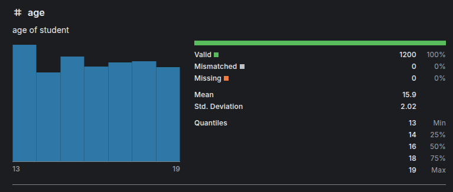

### 2.2. Coluna: Gender - Gênero do estudante (Categórica nominal)

O genero só possui dois tipos male e female e estão muito bem distribuidos em 51% e 49%

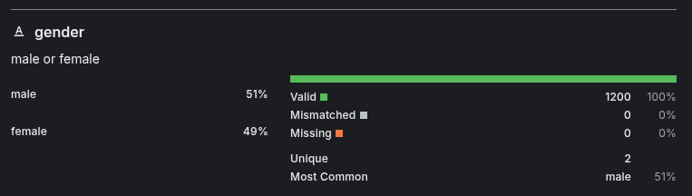

### 2.3. Column: Daily Social Media Hours - Horas gastas por dia em redes sociais (Numérica contínua)

As horas gastas por dias em redes sociais estão também bem distribuidas variando de 1 a 8 horas, média de 4.54 e desvio padrão de 2.03.

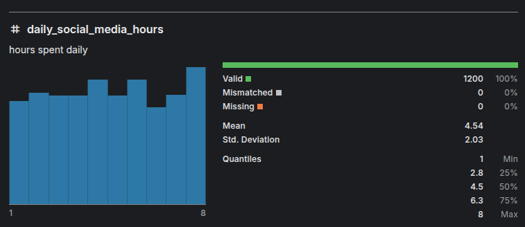

### 2.4. Column: Platform Usage - Uso de plataforma sociais (Categórica nominal)

A variável possui três categorias (Instagram, TikTok e Both), sendo que "Both" representa estudantes que utilizam ambas as plataformas. Como trata-se de uma variável categórica nominal, posteriormente será transformada por meio de One-Hot Encoding para utilização pelos algoritmos de classificação.

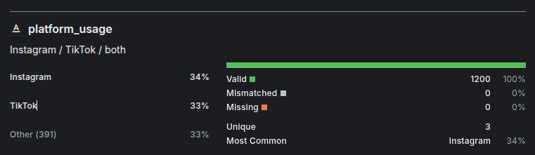

### 2.5. Column: Sleep Hours - Horas de sono (Numérica contínua)

A coluna horas de sono varia de 4 a 9 e tem dados bem distribuidos com uma média de 6.45 e um desvio padrao de 1.44.

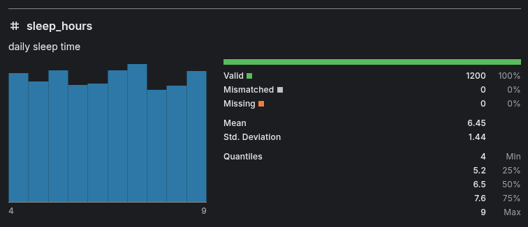

### 2.6. Column: Screen Time Before Sleep - Tempo de tela antes de dormir (Numérica contínua)

A coluna tempo de tela antes de dormir possui dados variando de 0.5 até 2.4 horas com uma média de 1.74 e uma variação de 0.72, os dados são bem distribuidos.

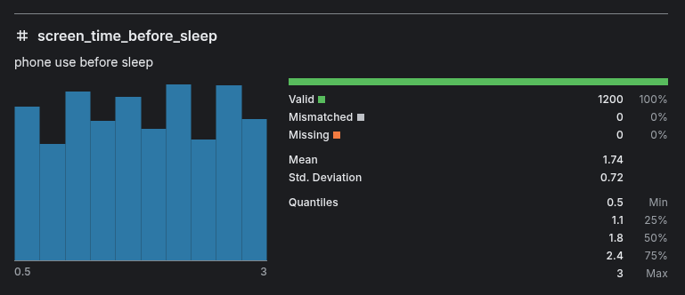

### 2.7. Column: Academic Performance - Performance escolar (Numérica contínua)

A coluna performance escolar tem dados bem distribuidos variando de 2 a 4 com média de 2.99 e variação de 0.58.

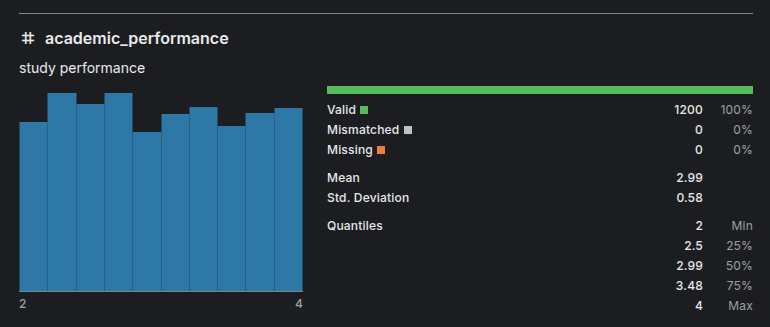

### 2.8. Column: Physical Activity - Atividade fisica (Numérica contínua)

A coluna apresenta maior concentração em determinados níveis de atividade física, porém sem indícios de inconsistências, com alguns picos com valores variando de 0 a 2, média de 1.01 e desvio de 0.58.

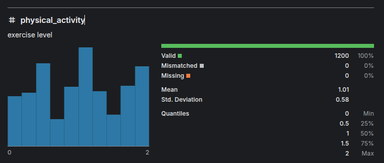

### 2.9. Column: Social Interaction Level - Nível de interação social (Categórica ordinal)

A coluna nivel de interação social possui 3 valores: high 31%, medium 35%, low 35%, até que bem distribuidos.

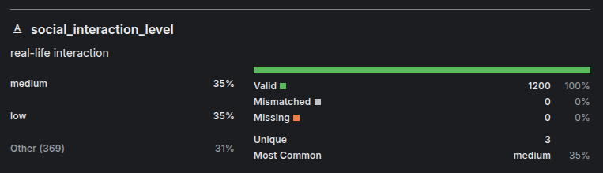

### 2.10. Column: Stress Level - Nível de estresse (Numérica discreta)

A coluna nivel de estresse possui valores até que bem distribuidos variando de 1 a 10, com média de 5.45 e desvio de 2.9.

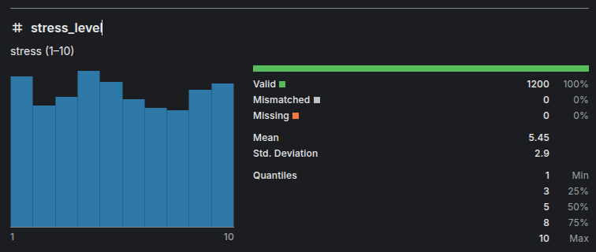

### 2.11. Column: Anxiety Level - Nível de ansiedade (Numérica discreta)

A coluna nivel de ansiedade também de valores bem distribuidos variando de 1 a 10, com média de 5.65 e desvio de 2.86.

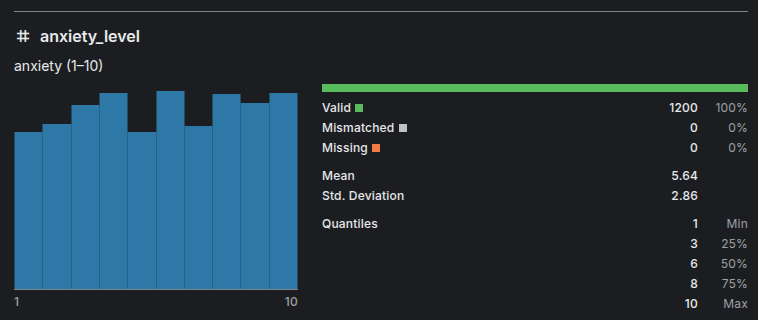

### 2.12. Column: Addiction Level - Nível de dependência (Numérica discreta)

A coluna nível de dependência também tem dados bem distribuidos variando de 1 a 10, com média de 5.57 e desvio de 2.83.

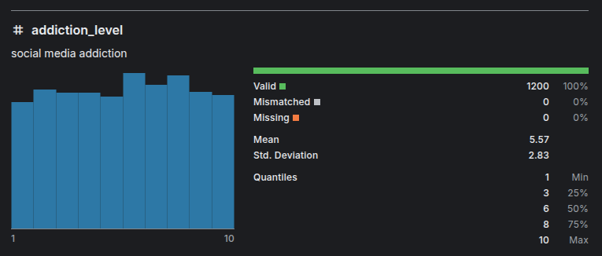

### 2.13. Column: Depression Label - Rótulo de depressão (Categórica binária)

A coluna depression label é a coluna explicativa do nosso dataset e ela define se o estudante possui depressão ou não, se 0 = não tem depressão, se 1 = tem depressão. 

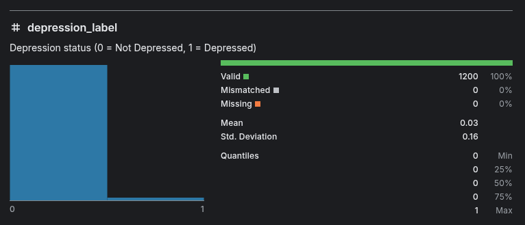

As estatisticas completas das colunas e o histograma podem ser conferidas no knime:

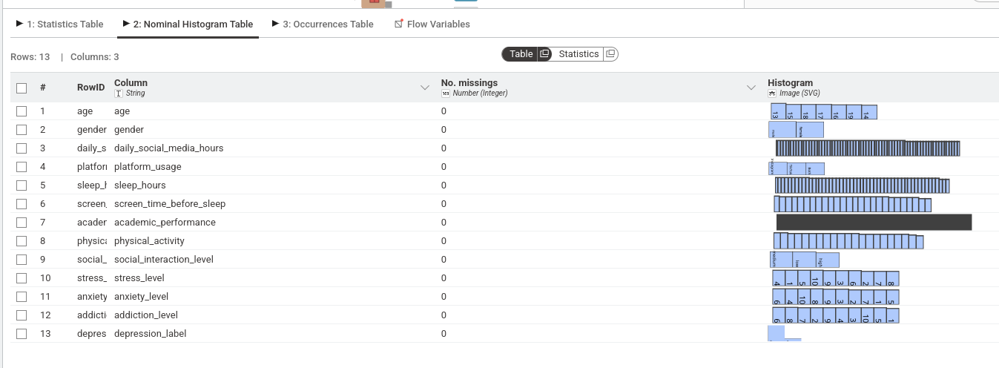

### 2.14. Desbalanceamento da classe alvo

A variável alvo apresenta forte desbalanceamento, com aproximadamente 97,4% (1169) dos registros pertencentes à classe "não deprimido" e apenas 2,6% (31) à classe "deprimido". Esse desbalanceamento pode prejudicar o treinamento dos modelos, favorecendo a classe majoritária. Para minimizar esse problema poderão ser utilizadas técnicas como SMOTE ou Oversampling durante o pré-processamento.

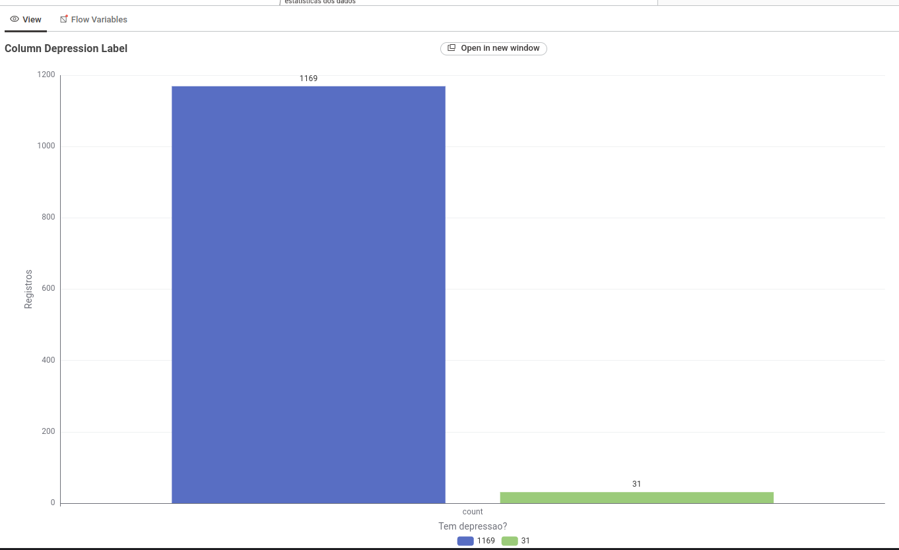

### 2.15. Matrix de correlação

A matriz de correlação demonstra que não existem correlações lineares fortes entre as variáveis numéricas. Todos os coeficientes encontrados são muito próximos de zero, variando aproximadamente entre -0,064 e 0,076.

As maiores correlações observadas foram:

+0,076 - Age × Screen Time Before Sleep
-0,064 - Academic Performance × Anxiety Level
-0,055 - Sleep Hours × Addiction Level

Mesmo essas relações são consideradas muito fracas, indicando que nenhuma variável, isoladamente, apresenta forte relação linear com outra.

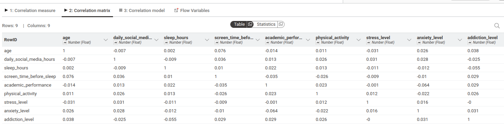

## 3. Etapa 3 - Modelos

### 3.1. Preparação para o modelo

#### 3.1.1. One hot encoding

Foram aplicados técnicas de one hot encoding para transformar as variáveis categóricas: gender, platform_usage e social_interaction_level em variáveis numéricas para serem utilizadas no treinamento.

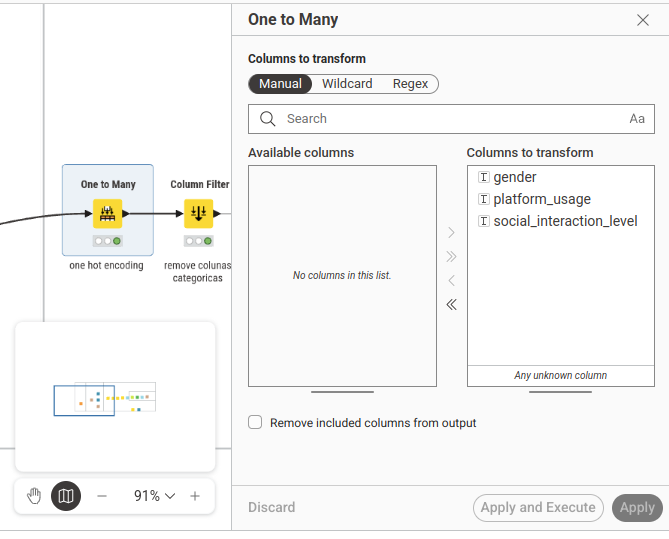

A técnica transforma cada categoria em uma nova coluna, por exemplo a coluna gender foi transformada em duas colunas: male e female.

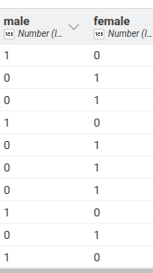

#### 3.1.2. Normalização

Foi aplicado também uma técnica de normalização nas colunas pois estavam em escalas diferentes, evitando que atributos muito maiores influenciassem no modelo: age, daily_social_media_hours, sleep_hours, screen_time_before_sleep, academic_performance, physical_activity, stress_level, anxiety_level, addiction_level.

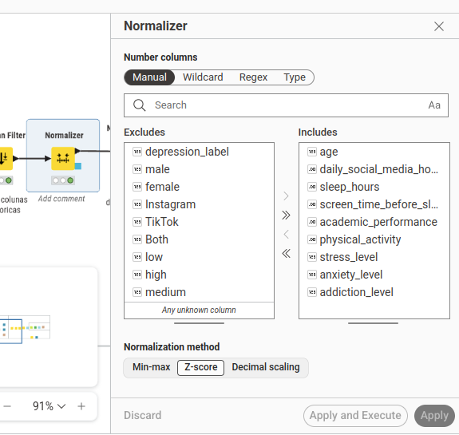

#### 3.1.3. Separação treino / teste

A separação dos dados em treino é teste foi feito para garantir que não haja vazamento de dados entre os dados de treino e dados de teste, além disso foi utilizado uma estratégia de estratificação dos dados 1.200 linhas em 10 partes (folds) de 120 linhas estratificando pela coluna depression_label, garantindo que cada fold contenha aproximadamente a mesma proporção de deprimidos (3) e não deprimidos (117), esta estratégia garante que os dados consigam ser separados treinados e testados da forma mais confiável possível já que a base é bem desbalanceada tendo apenas 31 registros com depressão de 1.200.

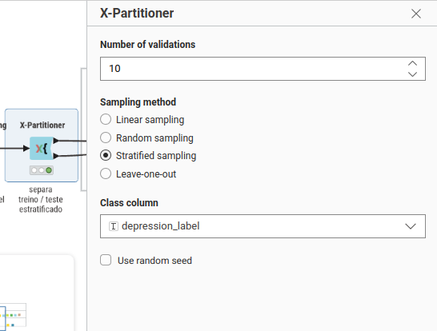

### 3.2. Modelo 1 regressão linear

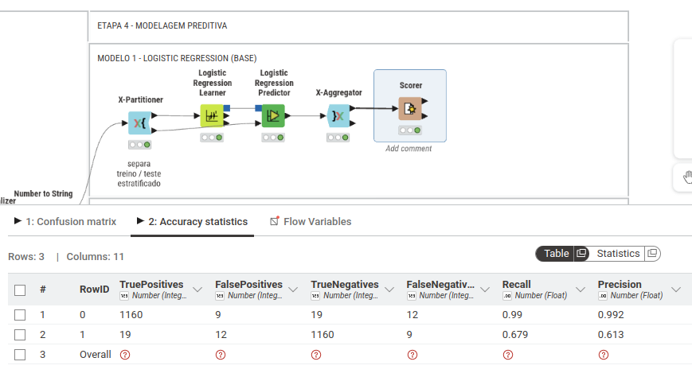

### 3.3. Modelo 2 regressão linear + data augmentation (SMOTE)

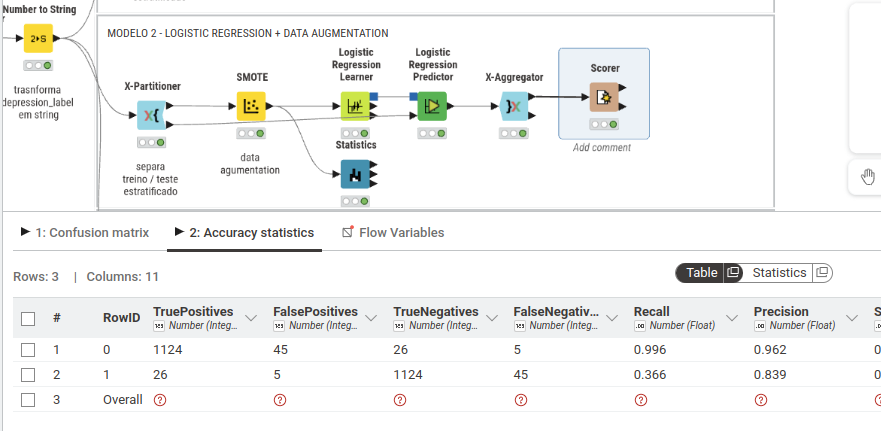

### 3.4. Comparação modelo 1 vs modelo 2
